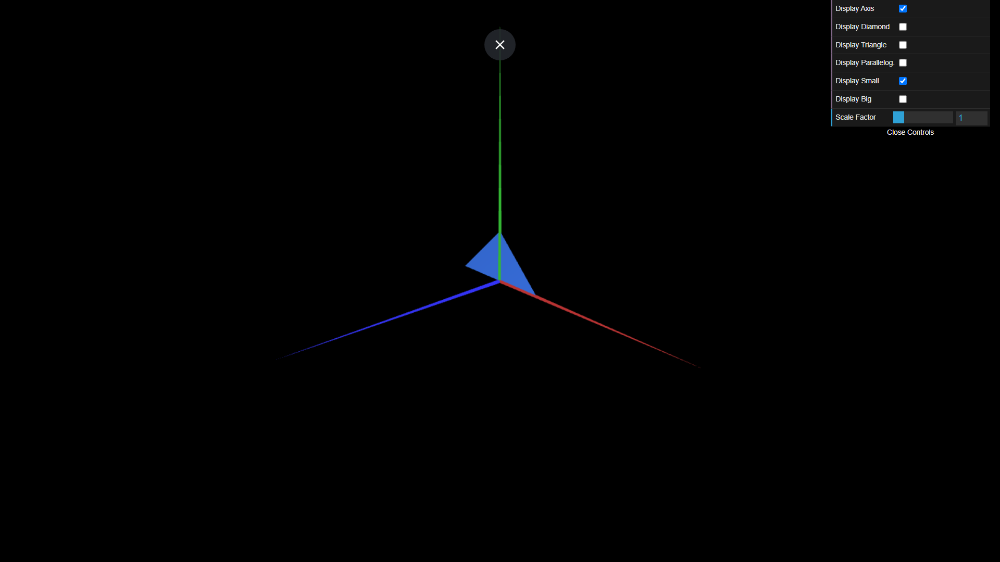
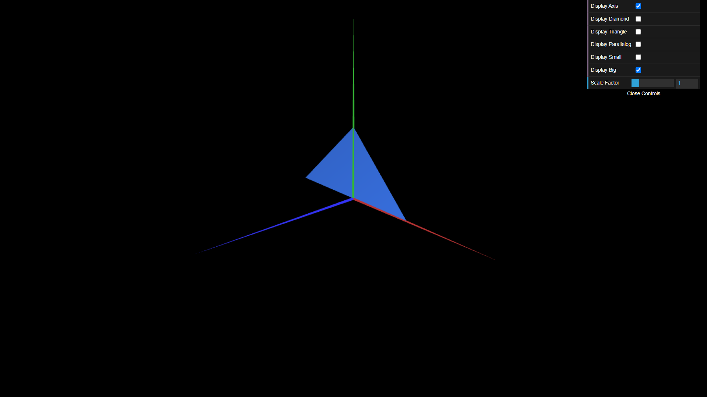

# CG 2023/2024

## Group T02G02

## TP 1 Notes

- No exercício 1 observamos a importância da ordem dos índices e da regra da mão direita para definir figuras double-sided.
- No exercício 2 assimilamos os conceitos anteriormente adquiridos.

