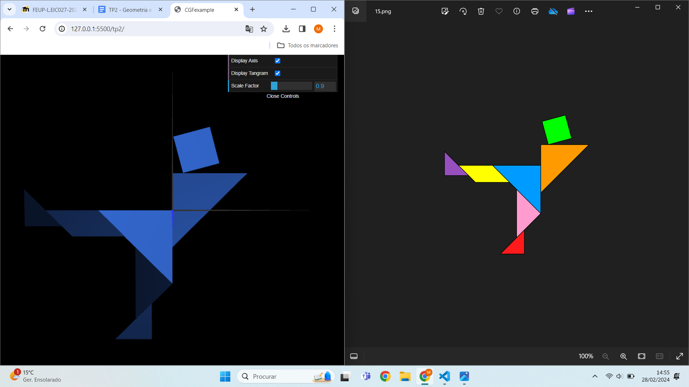
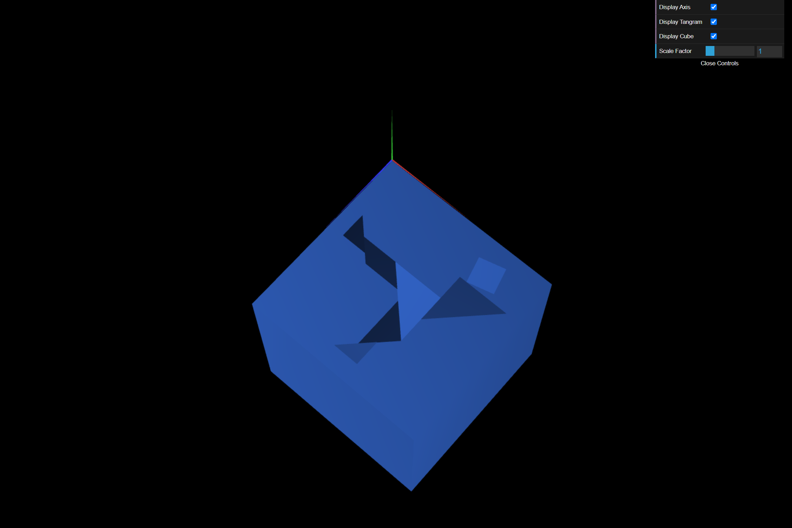
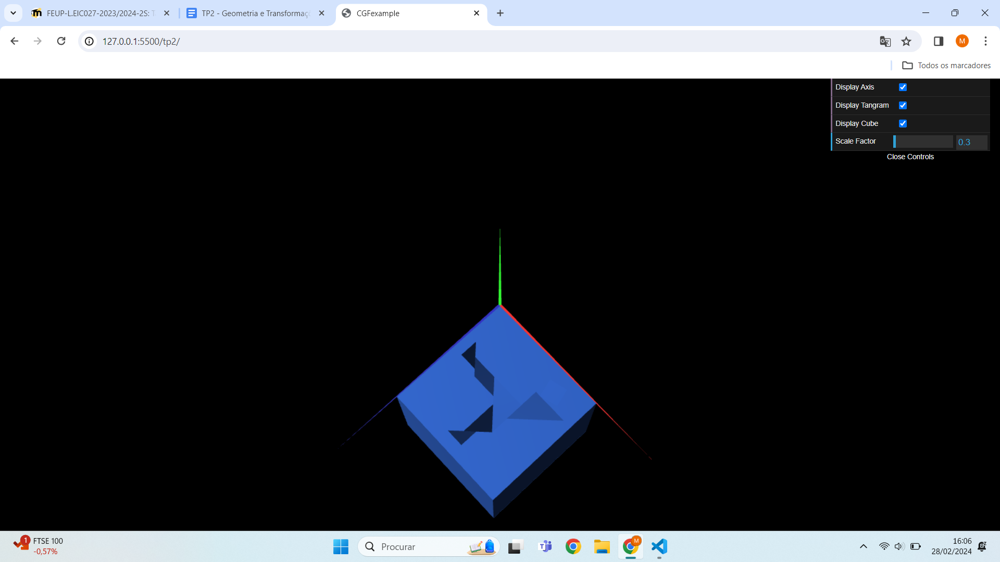

# CG 2023/2024

## Group T02G02

## TP 2 Notes

- No exercício 2, aprendemos a realizar transformações geométricas através da multiplicação de matrizes e das funções WebCGF
- No exercício 3, verificamos que as transformações geométricas em 3 dimensões são mais complexas e trabalhosas
- No exercício 4, descobrimos que não precisamos de criar vários objetos quadrados para formar um cubo, bastando apenas um 

