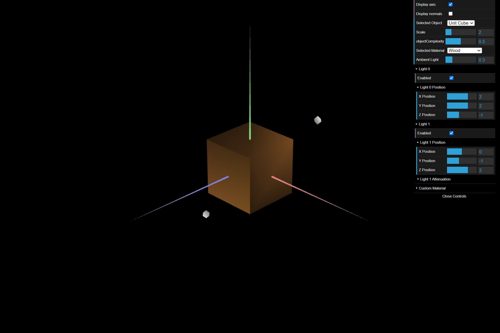

# CG 2023/2024

## Group T02G02

## TP3 Notes

- Na parte 1, percebemos a importância de agrupar os vértices de forma eficiente e de definir várias normais
- Na parte 2, aprendemos a utilizar ciclos para gerar vértices, índices e normais, melhorando a qualidade do código
- Na parte 3, compreendemos como suavizar as arestas de um sólido, através da redução do número de normais 

