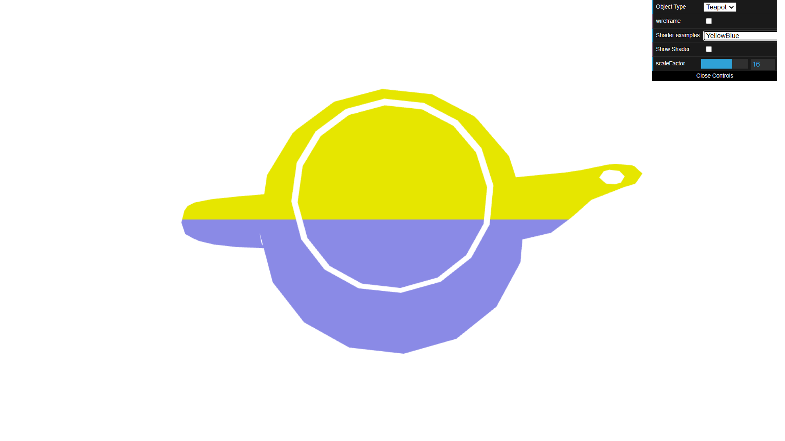
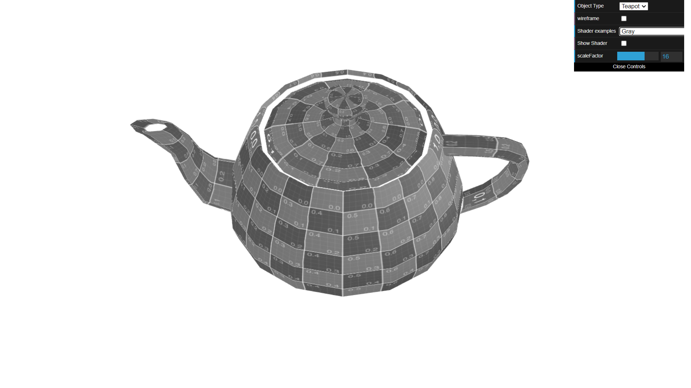
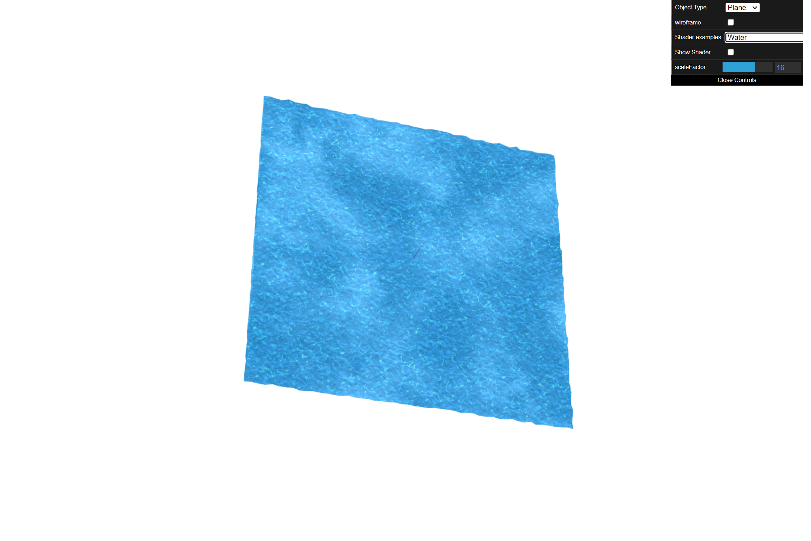

# CG 2023/2024

## Group T02G02

## TP5 Notes

- No exercício 1, familiarizamo-nos com os *shaders* (.vert e .frag)
- No exercício 2, tivemos dificuldades em animar a imagem da textura, conseguindo apenas uma oscilação pequena

